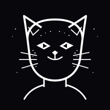
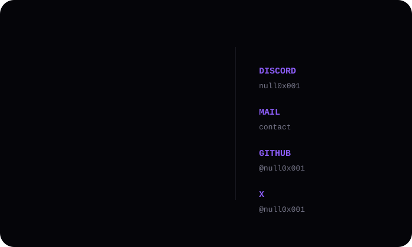

<!-- ══════════════════════════════════════════════════════════
     NULL0X001 - GitHub Profile README
     ══════════════════════════════════════════════════════════ -->

<!-- Visitor Counter -->

  

<!-- Typing Header -->

  

  
  

 

  

 

## Github Stats

  

 

  
  

 

  

 

## 📖 Currently Exploring

* Strengthening **Python fundamentals** through progressively harder projects
* Learning **Linux, networking, and cybersecurity** from the ground up
* Understanding how software works closer to the **system level**
* Exploring **hardware, electronics, Arduino, and Raspberry Pi**
* Building small projects and turning them into increasingly complex systems

 

## 🔨 What I'm Building

My projects start simple and evolve as my understanding grows.

Currently building through:

* **Python Builds** — small projects designed to strengthen fundamentals
* **PacketForge** — a toy network-packet calculator for learning networking concepts
* **Cybersecurity experiments** — Linux, networking, OSINT, and security tooling
* **Systems & hardware projects** — exploring the boundary between software and physical systems

 

## 🧠 How I Learn

I don't want to just memorize APIs.

I try to understand the fundamentals first, build something with them, break it, and then figure out why it broke.

**Learn → Build → Break → Understand → Rebuild**

 

⭐ <em>If something here helps you, a star is always appreciated.</em>

 
 

  

  

  

  
  

     Learning in public. Building from fundamentals.

